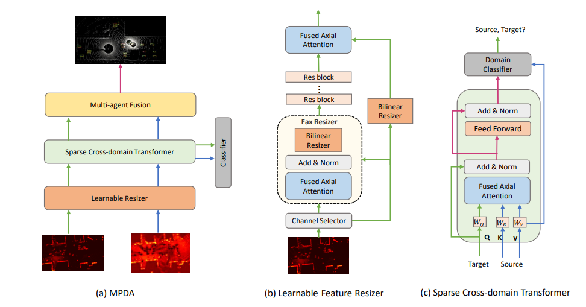

# Bridging the Domain Gap for Multi-Agent Perception [ICRA2023]

[](https://arxiv.org/pdf/2210.08451.pdf)
[]()
[]()


This is the official implementation of ICRA2023 paper "Bridging the Domain Gap for Multi-Agent Perception".
[Runsheng Xu](https://derrickxunu.github.io/), [Jinlong Li](https://jinlong17.github.io/), Xiaoyu Dong, [Honkai Yu](https://scholar.google.com/citations?user=JnQts0kAAAAJ&hl=en), [Jiaqi Ma](https://mobility-lab.seas.ucla.edu/)




## Installation
This repo is mainly based on the cooperative detection framework [OpenCOOD](https://github.com/DerrickXuNu/OpenCOOD). Therefore, the installations are the same.
```bash
# Clone repo
git clone https://github.com/DerrickXuNu/MPDA.git

cd MPDA

# Setup conda environment
conda create -y --name mpda python=3.7

conda activate mpda
# pytorch >= 1.8.1, newest version can work well
conda install pytorch==1.12.1 torchvision==0.13.1 cudatoolkit=11.6 -c pytorch -c conda-forge
# spconv 2.0 install, choose the correct cuda version for you
pip install spconv-cu116

# Install dependencies
pip install -r requirements.txt
# Install bbx nms calculation cuda version
python opencood/utils/setup.py build_ext --inplace

# install opencood into the environment
python setup.py develop
```

## Data
### Download
The V2XSet data can be found from [google url](https://drive.google.com/drive/folders/1r5sPiBEvo8Xby-nMaWUTnJIPK6WhY1B6?usp=sharing).  Since the data for train/validate/test
is very large, we  split each data set into small chunks, which can be found in the directory ending with `_chunks`, such as `train_chunks`. After downloading, please run the following command to each set to merge those chunks together:

```
cat train.zip.parta* > train.zip
unzip train.zip
```
### Structure
After downloading is finished, please make the file structured as following:

```sh
MPDA # root of your v2xvit
├── v2xset # the downloaded v2xset data
│   ├── train
│   ├── validate
│   ├── test
├── opencood # the core codebase

```
### Details
Our data label format is very similar with the one in [OPV2V](https://github.com/DerrickXuNu/OpenCOOD). For more details, please refer to the [data tutorial](docs/data_intro.md).

## Getting Started

### Step1. Train your model under homogenous setting
We will first need to train several sperate models under homogenous setting (i.e., all cavs use the same backbone)
OpenCOOD uses yaml file to configure all the parameters for training. To train your own model
from scratch or a continued checkpoint, run the following commonds:
```python
python opencood/tools/train.py --hypes_yaml ${CONFIG_FILE} [--model_dir  ${CHECKPOINT_FOLDER} --half]
```
Arguments Explanation:
- `hypes_yaml`: the path of the training configuration file, e.g. `opencood/hypes_yaml/point_pillar_v2xvit.yaml`, meaning you want to train
- `model_dir` (optional) : the path of the checkpoints. This is used to fine-tune the trained models. When the `model_dir` is
given, the trainer will discard the `hypes_yaml` and load the `config.yaml` in the checkpoint folder.
- `half`(optional): if specified, hybrid-precision training will be used to save memory occupation.

### Step2. Generate the offline intermediate features
After obtaining the models trained on homo setting, we need to save the intermediate features that each model generate to study later domain gap issue.
To do this:
- first change `save_feature` flag in your model configruation to true,
- then change the `validate_dir` to the set you want (train, test or val of v2xet).
- set `output_folder` to the path you want to save the intermediate features in a `.npy` format

After finishing changing the configuration yaml files in your trained model directory, run the testing command:
```python
python opencood/tools/inference.py --model_dir ${CHECKPOINT_FOLDER} --fusion_method ${FUSION_STRATEGY} [--show_vis] [--show_sequence]
```
Arguments Explanation:
- `model_dir`: the path to your saved model.
- `fusion_method`: indicate the fusion strategy, currently support 'early', 'late', and 'intermediate'.
- `show_vis`: whether to visualize the detection overlay with point cloud.
- `show_sequence` : the detection results will visualized in a video stream. It can NOT be set with `show_vis` at the same time.

This will automatically generate the intermeidate features npy files under your pointed path.

### Step3. Run V2XViT training with domain adaption.
- First, create a new model folder under `opencood/logs` and name it as `v2xvit_da`. 
- Copy the v2x-vit checkpoint with poinpillar bakcbone you trained in Step1 to `v2xvit_da`
- Copy the `hypes_yaml/v2xvit_da.yaml` to `v2xvit_da` and rename it as `config.yaml`
- Modify the data paths in `config.yaml`. The source and target data directory should point the intermediate feature npy files you generate in Step2 from different models.
- Run the following command to train:
```python
python opencood/tools/train.py --hypes_yaml None --model_dir opencood/logs/v2xvit_da
```

### Step4. Run test under heterogeneous setting
Please change the `validate_dir_s` and `validate_dir_t` in the yaml to test set of the generated intermediate feature data from different models.
Then run the following command:
```python
python opencood/tools/inference.py --model_dir opencood/logs/v2xvit_da --fusion_method intermediate
```


## Citation
 If you are using our V2X-ViT model or V2XSet dataset for your research, please cite the following paper:
 ```bibtex
@inproceedings{xu2023mpda,
  author = {Runsheng Xu, Jinlong Li, Xiaoyu Dong, Hongkai Yu Jiaqi Ma},
  title = {Bridging the Domain Gap for Multi-Agent Perception},
  booktitle={2023 IEEE International Conference on Robotics and Automation (ICRA)},
  year = {2023}}
```

## Acknowledgement
MPDA is build upon [OpenCOOD](https://github.com/DerrickXuNu/OpenCOOD), which is the first Open Cooperative Detection framework for autonomous driving.

V2XSet is collected using [OpenCDA](https://github.com/ucla-mobility/OpenCDA), which is the first open co-simulation-based research/engineering framework integrated with prototype cooperative driving automation pipelines as well as regular automated driving components (e.g., perception, localization, planning, control).
